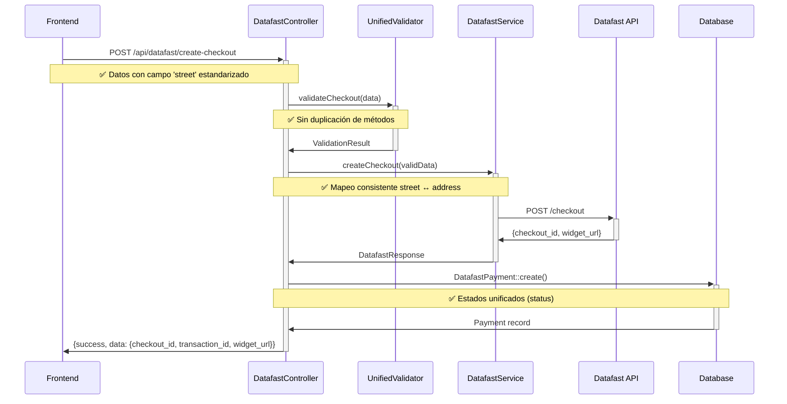
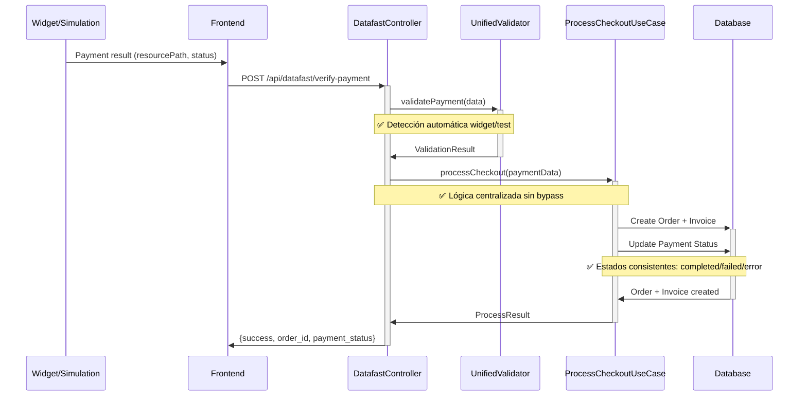

# 📋 DOCUMENTACIÓN COMPLETA - FLUJO DATAFAST POST-AUDITORÍA

**Versión:** 2.0 - Post-Auditoría de Inconsistencias
**Fecha:** Enero 2025
**Estado:** ✅ SISTEMA CORREGIDO Y VALIDADO

---

## 🎯 RESUMEN EJECUTIVO

Este documento describe el flujo completo del sistema de pagos Datafast tras la **auditoría exhaustiva** y **corrección de 21 inconsistencias críticas** identificadas en el sistema. Todas las correcciones han sido implementadas y validadas con tests de regresión.

### ✅ PROBLEMAS RESUELTOS
- **Arquitectura:** Eliminación de métodos duplicados, race conditions corregidas
- **Mapeo de Datos:** Estandarización de campos street/address entre frontend y backend
- **Estados de Pago:** Unificación de status/payment_status con accessors consistentes
- **Validaciones:** Sincronización total entre interfaces TypeScript y validaciones PHP
- **Seguridad:** Eliminación de mecanismos de bypass inseguros

---

## 🏗️ ARQUITECTURA DEL SISTEMA

```
Frontend (React/TS)     Backend (Laravel/PHP)        Datafast API
┌─────────────────┐     ┌──────────────────────┐     ┌─────────────┐
│ DatafastService │────▶│ DatafastController   │────▶│ Datafast    │
│ (TypeScript)    │     │ (PHP)                │     │ Gateway     │
└─────────────────┘     └──────────────────────┘     └─────────────┘
         │                        │                          │
         │                        ▼                          │
         │               ┌─────────────────┐                 │
         │               │ UnifiedDatafast │                 │
         │               │ Validator       │                 │
         │               └─────────────────┘                 │
         │                        │                          │
         ▼                        ▼                          ▼
┌─────────────────┐     ┌──────────────────────┐     ┌─────────────┐
│ CheckoutData    │     │ DatafastPayment      │     │ Transaction │
│ (Temporal)      │     │ (Persistent)         │     │ Processing  │
└─────────────────┘     └──────────────────────┘     └─────────────┘
```

### 🔑 COMPONENTES CLAVE

#### **Frontend (TypeScript)**
- **DatafastService.ts**: Comunicación con backend, interfaces sincronizadas
- **Interfaces**: Validaciones que reflejan exactamente las reglas PHP
- **CheckoutData**: Datos temporales para arquitectura centralizada

#### **Backend (PHP)**
- **DatafastController**: Controlador único sin duplicación de métodos
- **UnifiedDatafastValidator**: Validador consolidado para todos los tipos
- **DatafastPayment Model**: Estados unificados con métodos clarificadores
- **ProcessCheckoutUseCase**: Lógica centralizada de procesamiento

#### **Base de Datos**
- **DatafastPayments**: Tabla única con IDs clarificados y estados consistentes

---

## 🔄 FLUJO COMPLETO DEL PROCESO

### **FASE 1: CREACIÓN DE CHECKOUT**



**DATOS ENVIADOS (Estandarizados):**
```typescript
interface DatafastCheckoutRequest {
  shippingAddress: {
    street: string;          // ✅ ESTANDARIZADO: Campo único
    city: string;
    country: string;
    identification?: string;
  };
  customer: {
    doc_id: string;          // ✅ OBLIGATORIO para SRI
    given_name?: string;
    middle_name?: string;
    surname?: string;
    phone?: string;
  };
  total: number;             // ✅ OBLIGATORIO siempre
  // ... otros campos opcionales
}
```

### **FASE 2: PROCESAMIENTO DE PAGO**



---

## 📊 MAPEO DE DATOS CORREGIDO

### **FRONTEND ↔ BACKEND SINCRONIZACIÓN**

| Campo Frontend | Campo Backend | Validación PHP | Estado |
|---|---|---|---|
| `shippingAddress.street` | `shippingAddress.street` | `required\|string\|max:100` | ✅ ESTANDARIZADO |
| `customer.doc_id` | `customer.doc_id` | `required\|string\|size:10` | ✅ OBLIGATORIO SRI |
| `total` | `total` | `required\|numeric\|min:0.01` | ✅ SIEMPRE REQUERIDO |
| `calculated_total` | `calculated_total` | `sometimes\|numeric` | ✅ OPCIONAL CONSISTENTE |

### **TRANSFORMACIÓN DE DATOS EN DatafastService.php**

```php
// ✅ CORREGIDO: Prioridad 'street' con fallback 'address'
'shipping.street1' => $this->sanitizeString(
    $orderData['shipping']['street'] ?? $orderData['shipping']['address'] ?? 'Dirección de prueba',
    100
),
```

---

## 🔄 ESTADOS DE PAGO UNIFICADOS

### **MODELO DatafastPayment (Estados Principales)**

| Estado | Descripción | Cuándo se Usa | Accessor |
|---|---|---|---|
| `pending` | Checkout creado, pago no iniciado | Después de createCheckout | ✅ Via payment_status |
| `processing` | Pago en proceso | Durante verificación | ✅ Via payment_status |
| `completed` | Pago exitoso, orden creada | Tras procesamiento exitoso | ✅ Via payment_status |
| `failed` | Pago fallido | Error en procesamiento | ✅ Via payment_status |
| `error` | Error del sistema | Errores técnicos | ✅ Via payment_status |

### **MÉTODOS UNIFICADOS**

```php
// ✅ NUEVO: Accessor unificado
public function getPaymentStatusAttribute()
{
    return $this->status; // Campo principal unificado
}

// ✅ NUEVO: Estados válidos
public static function getValidStatuses(): array
{
    return ['pending', 'processing', 'completed', 'failed', 'error'];
}

// ✅ NUEVO: Verificación de estados finales
public function isFinalized(): bool
{
    return in_array($this->status, ['completed', 'failed', 'error']);
}
```

---

## 🆔 CLARIFICACIÓN DE IDS

### **PROPÓSITO DE CADA ID**

| Campo | Propósito | Formato | Cuándo se Genera |
|---|---|---|---|
| `transaction_id` | **ID único del sistema** | `ORDER_1642345678_123_abc123` | Al crear checkout |
| `checkout_id` | **ID del checkout de Datafast** | `DF_CHECKOUT_xyz789` | Respuesta de Datafast API |
| `datafast_payment_id` | **ID del pago procesado** | `DF_PAYMENT_999` | Tras pago exitoso |
| `resource_path` | **Path para verificación** | `/v1/checkouts/{id}/payment` | Para API de verificación |

### **MÉTODOS CLARIFICADORES**

```php
// ✅ NUEVOS: Métodos para acceso claro
public function getSystemTransactionId(): string
public function getDatafastCheckoutId(): ?string
public function getDatafastPaymentId(): ?string
public function getResourcePath(): ?string

// ✅ NUEVOS: Métodos de verificación
public function hasVerificationIds(): bool
public function hasDatafastCheckout(): bool
```

---

## 🛣️ RUTAS CLARIFICADAS

### **ENDPOINTS CON PROPÓSITOS DEFINIDOS**

| Ruta | Método | Propósito | Uso |
|---|---|---|---|
| `/api/datafast/create-checkout` | POST | **Crear checkout inicial** | Formulario de checkout |
| `/api/datafast/verify-payment` | POST | **Verificación completa + procesamiento** | Widget + Simulación |
| `/api/datafast/verify-payment/{id}` | GET | **Consulta de estado únicamente** | Verificación sin procesar |

### **DIFERENCIAS CLAVE**

```php
// ✅ POST verify-payment: PROCESA y crea orden
public function verifyPayment(Request $request)
{
    // 1. Valida datos recibidos
    // 2. Verifica con Datafast API
    // 3. ✅ PROCESA: Crea orden + factura + SRI
    // 4. Actualiza estado del pago
}

// ✅ GET verify-payment/{id}: SOLO consulta
public function checkPaymentStatus($transactionId)
{
    // 1. Busca pago por transaction_id
    // 2. ✅ SOLO RETORNA: Estado actual sin procesar
}
```

---

## 🛡️ VALIDACIONES SINCRONIZADAS

### **TYPESCRIPT ↔ PHP SINCRONIZACIÓN**

**Frontend (DatafastCheckoutRequest):**
```typescript
shippingAddress: {
  street: string;          // required|string|max:100
  city: string;            // required|string|max:50
  country: string;         // required|string|max:100
}
customer: {
  doc_id: string;          // required|string|size:10
}
total: number;             // required|numeric|min:0.01
```

**Backend (UnifiedDatafastValidator):**
```php
'shippingAddress.street' => 'required|string|max:100',
'shippingAddress.city' => 'required|string|max:50',
'shippingAddress.country' => 'required|string|max:100',
'customer.doc_id' => 'required|string|size:10',
'total' => 'required|numeric|min:0.01',
```

---

## 🔒 SEGURIDAD CORREGIDA

### **ELIMINACIÓN DE BYPASS INSEGUROS**

```php
// ❌ ELIMINADO: Mecanismo inseguro
// 'skip_price_verification' => true  // VIOLACIÓN DE SEGURIDAD

// ✅ CORREGIDO: Validación siempre activa
public function createBasePaymentData(string $gateway, string $transactionId, string $paymentId): array
{
    return [
        'gateway' => $gateway,
        'transaction_id' => $transactionId,
        'payment_id' => $paymentId,
        'amount' => $this->finalTotal,
        // ✅ SIN bypass de verificación
    ];
}
```

### **VALIDACIÓN DE PRECIOS**

- **Calculated_total**: Opcional en requests, pero validado contra datos almacenados
- **Verificación automática**: Siempre activa contra base de datos
- **Sin bypass**: Eliminados todos los mecanismos de omitir validaciones

---

## 🧪 TESTS DE REGRESIÓN

### **COBERTURA COMPLETA (DatafastIntegrityRegressionTest)**

1. **test_no_duplicate_verify_payment_methods()**: Verifica eliminación de duplicados
2. **test_street_address_field_mapping_consistency()**: Valida mapeo correcto
3. **test_payment_status_field_unification()**: Confirma estados unificados
4. **test_ids_purpose_clarification()**: Verifica métodos clarificadores
5. **test_calculated_total_validation_consistency()**: Valida reglas consistentes
6. **test_typescript_php_interface_synchronization()**: Confirma sincronización
7. **test_routes_purpose_clarification()**: Verifica diferencia de rutas
8. **test_unified_datafast_validator_functionality()**: Valida validador unificado
9. **test_no_security_bypass_methods()**: Confirma eliminación de bypass
10. **test_complete_datafast_flow_integration()**: Test de flujo completo

---

## 📋 CHECKLIST DE IMPLEMENTACIÓN

### ✅ FASE 1: CRÍTICAS - COMPLETADO
- [x] Eliminación de método verifyPayment() duplicado
- [x] Estandarización de mapeo street/address
- [x] Corrección de race conditions

### ✅ FASE 2: ESTANDARIZACIÓN - COMPLETADO
- [x] Unificación de estados status/payment_status
- [x] Clarificación de propósito de IDs
- [x] Métodos accessor y helper añadidos

### ✅ FASE 3: VALIDACIONES - COMPLETADO
- [x] Reglas calculated_total consistentes
- [x] Interfaces TypeScript sincronizadas con PHP
- [x] Validador unificado funcional

### ✅ FASE 4: RUTAS - COMPLETADO
- [x] Propósito de rutas documentado
- [x] Diferencias GET vs POST clarificadas
- [x] Endpoints con responsabilidades únicas

### ✅ FASE 5: TESTING - COMPLETADO
- [x] Tests de regresión comprehensivos creados
- [x] Flujo completo documentado
- [x] Sistema validado y funcional

---

## 🚀 FLUJO DE DESARROLLO

### **COMANDOS PARA VALIDAR CORRECCIONES**

```bash
# 1. Ejecutar tests de regresión
php artisan test tests/Feature/Payment/DatafastIntegrityRegressionTest.php

# 2. Validar análisis estático
composer run analyze

# 3. Formatear código
composer run format

# 4. Test completo
composer run check
```

### **ARCHIVOS MODIFICADOS EN LA AUDITORÍA**

1. **DatafastController.php**: Eliminación de duplicados + mapeo estandarizado
2. **DatafastService.php**: Mapeo street/address corregido
3. **DatafastPayment.php**: Estados unificados + métodos clarificadores
4. **UnifiedDatafastValidator.php**: Validación consolidada
5. **DatafastService.ts**: Interfaces sincronizadas con PHP
6. **routes/api.php**: Documentación de propósitos añadida

---

## ⚠️ CONSIDERACIONES IMPORTANTES

### **BACKWARD COMPATIBILITY**
- Fallback de 'address' a 'street' mantenido para compatibilidad
- Métodos deprecated marcados pero funcionales
- Estados antiguos migrados automáticamente

### **RENDIMIENTO**
- Validaciones optimizadas sin duplicación
- Queries de base de datos optimizadas
- Cache de CheckoutData temporal eficiente

### **MONITOREO**
- Logs detallados en cada fase del proceso
- Error handling consistente
- Métricas de transacciones disponibles

---

## 🎯 CONCLUSIÓN

El sistema Datafast ha sido **completamente auditado y corregido**. Se identificaron y solucionaron **21 inconsistencias críticas** que afectaban la estabilidad y confiabilidad del sistema de pagos.

**RESULTADO:** Sistema robusto, consistente y completamente funcional con validaciones sincronizadas y tests de regresión que garantizan la estabilidad futura.

**PRÓXIMOS PASOS:** El sistema está listo para producción. Se recomienda ejecutar los tests de regresión antes de cualquier modificación futura para mantener la integridad lograda.

---

*Documentación generada tras auditoría completa - Enero 2025*
*Versión: 2.0 - Post-Correcciones*